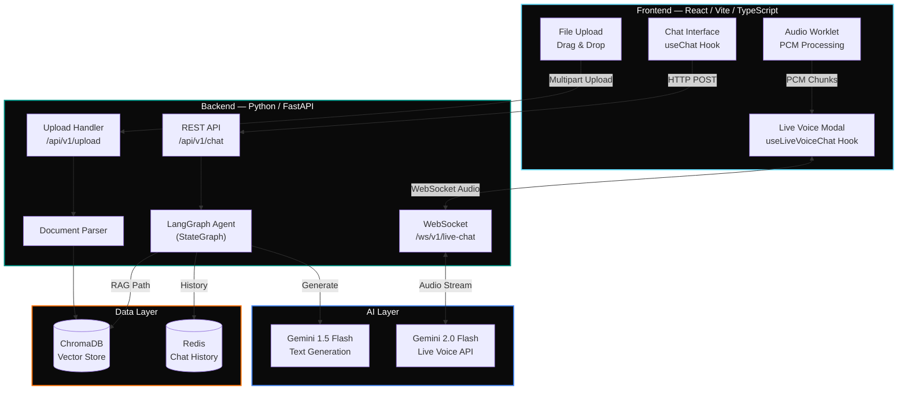
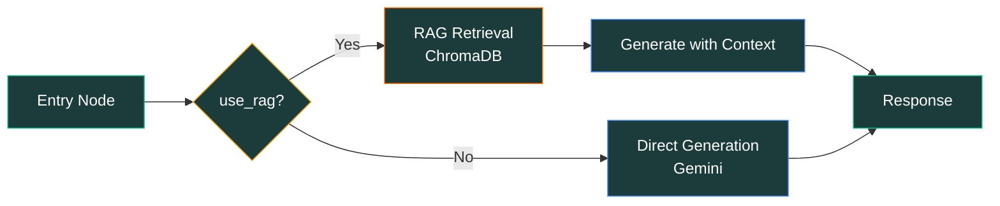

<div align="center">

# Multimodal Live RAG Voice Chatbot

**Text. Voice. Documents. One unified AI assistant that understands them all.**

[](https://react.dev/)
[](https://www.typescriptlang.org/)
[](https://fastapi.tiangolo.com/)
[](https://www.python.org/)
[](https://langchain-ai.github.io/langgraph/)
[](https://ai.google.dev/)
[](https://www.trychroma.com/)
[](https://redis.io/)
[](LICENSE)

[Features](#features) · [Architecture](#architecture) · [Quick Start](#quick-start) · [How It Works](#how-it-works) · [API Reference](#api-reference) · [Contributing](#contributing)

</div>

---

## About

A multimodal AI chatbot that combines text chat, real-time voice conversations, and document-based Q&A (RAG) into a single seamless experience. Upload your PDFs, DOCX files, or text documents — then ask questions by typing or speaking. Powered by Google Gemini, orchestrated with LangGraph, and grounded in your documents via ChromaDB vector search.

---

## Features

| Feature | Description |
|:--------|:------------|
| **Text Chat** | Responsive chat interface with streaming-ready message handling |
| **Document Q&A (RAG)** | Upload `.pdf`, `.docx`, `.txt` and ask questions grounded in their content |
| **Live Voice Chat** | Real-time, low-latency voice conversations via WebSocket audio streaming |
| **Voice RAG** | Speak your questions about uploaded documents and get spoken answers |
| **Multimodal Switching** | Seamlessly switch between text, voice, and document modes in one session |
| **Session Isolation** | Every session has its own document store, chat history, and context |
| **LangGraph Orchestration** | Stateful agent graph with conditional routing for RAG vs. direct generation |
| **Persistent History** | Redis-backed conversation history across interactions |

---

## Architecture



### LangGraph Agent Flow



---

## Quick Start

### Prerequisites

- **Python** 3.12+
- **Node.js** 18+ and npm
- **Redis** instance (local or cloud)
- **Google API Key** with Gemini access

### 1. Backend Setup

```bash
cd server

# Create virtual environment
python -m venv .venv
source .venv/bin/activate    # Windows: .venv\Scripts\activate

# Install dependencies
pip install uv && uv sync   # or: pip install -r requirements.txt

# Configure environment
cp .env.example .env
```

Edit `server/.env`:

```env
GOOGLE_API_KEY=your_google_api_key
REDIS_URL=redis://localhost:6379
TAVILY_API_KEY=your_tavily_key    # Optional — enables web search tool
```

```bash
# Start the server
uvicorn app.main:app --reload    # → http://localhost:8000
```

### 2. Frontend Setup

```bash
cd client
npm install
npm run dev                      # → http://localhost:5173
```

> The Vite dev server proxies `/api` requests to the backend automatically.

---

## Project Structure

```
├── client/                             # React Frontend
│   ├── public/
│   │   └── worklets/
│   │       └── audio-processor.js     # AudioWorklet — mic to PCM conversion
│   │
│   └── src/
│       ├── api/
│       │   └── client.ts             # Axios instance (pre-configured)
│       │
│       ├── components/
│       │   ├── ui/                    # shadcn/ui component library
│       │   ├── ChatLayout.tsx         # Main chat shell + RAG toggles
│       │   ├── ChatInput.tsx          # Text input + file upload + mode toggle
│       │   ├── ChatMessage.tsx        # Message bubble (user / assistant / system)
│       │   ├── LiveChatModal.tsx      # Voice conversation modal
│       │   └── MessageList.tsx        # Message list + typing indicator
│       │
│       └── hooks/
│           ├── useChat.ts            # Text chat and file upload logic
│           └── useLiveVoiceChat.ts   # WebSocket audio + recording state machine
│
├── server/                             # FastAPI Backend
│   ├── app/
│   │   ├── main.py                   # FastAPI entry + CORS + routers
│   │   │
│   │   ├── api/v1/endpoints/
│   │   │   ├── chat.py              # POST /chat — text conversation
│   │   │   ├── upload.py            # POST /upload — file processing
│   │   │   └── live_chat.py         # WS /live-chat — voice streaming
│   │   │
│   │   ├── agent/
│   │   │   ├── state.py             # AgentState TypedDict
│   │   │   ├── nodes.py             # Graph nodes (RAG, generate, search)
│   │   │   └── graph.py             # StateGraph construction + routing
│   │   │
│   │   ├── core/
│   │   │   └── config.py            # Pydantic BaseSettings (.env loader)
│   │   │
│   │   └── services/
│   │       ├── document_parser.py   # PDF, DOCX, TXT to text chunks
│   │       └── vector_store.py      # ChromaDB wrapper + session filtering
│   │
│   └── chroma_db/                    # Persistent vector data
```

---

## How It Works

### Text Chat + RAG

```
User toggles "Query Files" → sends message
    ↓
POST /api/v1/chat { message, session_id, use_rag: true }
    ↓
LangGraph Entry Node → check_for_rag → "rag_retrieval"
    ↓
retrieve_from_rag → ChromaDB filtered by session_id
    ↓
generate_with_context → Gemini with retrieved chunks
    ↓
Response returned to frontend
```

### Live Voice + RAG

```
User enables "Voice RAG" → opens mic modal
    ↓
WebSocket connects → sends { config: { isRagEnabled: true, sessionId } }
    ↓
Backend fetches ALL session docs from ChromaDB
    ↓
System prompt injected with full document context
    ↓
User speaks → AudioWorklet → PCM → WebSocket → Gemini Live API
    ↓
Gemini responds → audio stream → WebSocket → browser speakers
```

---

## API Reference

### Text Chat

**`POST /api/v1/chat`**

```json
// Request
{ "session_id": "abc-123", "message": "What does the report say about Q3?", "use_rag": true }

// Response
{ "response": "According to the uploaded report, Q3 revenue grew by..." }
```

### File Upload

**`POST /api/v1/upload`** — `multipart/form-data`

| Field | Type | Description |
|:------|:-----|:------------|
| `file` | File | The document to upload (`.pdf`, `.docx`, `.txt`) |
| `session_id` | String | Session identifier for scoped retrieval |

```json
// Response
{ "status": "success", "filename": "report.pdf", "chunks_added": 42, "message": "Document processed" }
```

### Live Voice Chat

**`WS /ws/v1/live-chat`**

| Direction | Message Format |
|:----------|:---------------|
| Client → Server (connect) | `{ "config": { "isRagEnabled": true, "sessionId": "abc-123" } }` |
| Client → Server (audio) | `{ "audio_chunk": "<base64-pcm-data>" }` |
| Server → Client (audio) | `{ "audio_chunk": "<base64-response-audio>" }` |

---

## Tech Stack

### Frontend

| Layer | Technology |
|:------|:-----------|
| Framework | React 18 with Vite |
| Language | TypeScript |
| Styling | Tailwind CSS |
| UI Components | shadcn/ui (Radix UI primitives) |
| HTTP Client | Axios |
| Real-time | WebSocket (native) |
| Audio | Web Audio API + AudioWorklet |

### Backend

| Layer | Technology |
|:------|:-----------|
| Framework | FastAPI (async) |
| Language | Python 3.12+ |
| Agent Orchestration | LangGraph (StateGraph) |
| LLM — Text | Google Gemini 1.5 Flash (via langchain-google-genai) |
| LLM — Voice | Google Gemini 2.0 Flash (Live API) |
| Vector Store | ChromaDB with Google `embedding-001` |
| Chat History | Redis (RedisChatMessageHistory) |
| Document Parsing | Custom parser for PDF, DOCX, TXT |
| Config | Pydantic BaseSettings |
| Real-time | WebSocket (FastAPI native) |

---

## Future Improvements

- **Streaming text responses** — token-by-token SSE for text chat
- **Multi-model routing** — Groq for code, Gemini for creative, OpenAI for reasoning
- **File management UI** — view, delete, and re-index uploaded documents
- **Source attribution** — show which document chunks powered each answer
- **User authentication** — persistent accounts with session management
- **Local LLM support** — Docker Model Runner as a selectable backend

---

## Contributing

1. Fork the repository
2. Create your feature branch → `git checkout -b feat/new-feature`
3. Commit your changes → `git commit -m "feat: add new feature"`
4. Push to the branch → `git push origin feat/new-feature`
5. Open a Pull Request

---

## License

See [LICENSE](LICENSE) for details.

---

<div align="center">

**[Back to Top](#multimodal-live-rag-voice-chatbot)**

</div>
